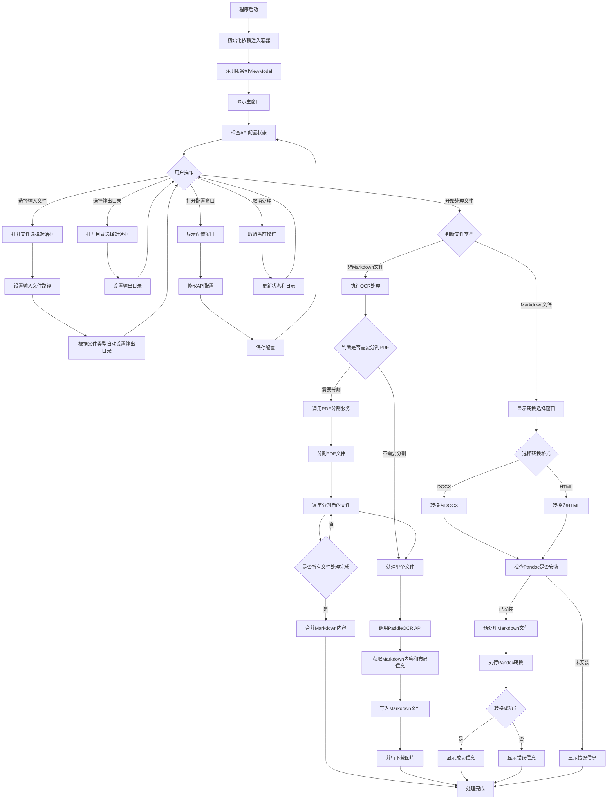

# DocuConvertPro 程序流程图

## 主要流程说明

### 1. 程序启动与初始化

- 初始化依赖注入容器
- 注册服务（OCR服务、配置服务、日志服务等）
- 注册ViewModel（主窗口ViewModel、配置窗口ViewModel、Markdown转换窗口ViewModel）
- 显示主窗口并检查API配置状态

### 2. 用户交互

- **选择输入文件**：支持PDF、图片（JPG、PNG等）和Markdown格式
- **选择输出目录**：指定转换后的文件保存位置
- **打开配置窗口**：设置API URL和Token
- **开始处理文件**：根据文件类型执行不同的处理流程

### 3. 文件处理流程

#### 3.1 非Markdown文件（PDF、图片）

1. **判断是否需要分割PDF**：如果PDF页数>100页或文件大小>10MB，则需要分割
2. **PDF分割**：调用PDF分割服务将大文件分割成多个小文件
3. **处理单个文件**：
   - 调用PaddleOCR API处理文件
   - 获取Markdown内容和布局信息
   - 将Markdown内容写入文件
   - 并行下载布局信息中的图片
4. **合并分割文件**：如果是分割后的PDF文件，合并所有分割文件的Markdown内容

#### 3.2 Markdown文件

1. **显示转换选择窗口**：让用户选择转换格式（DOCX或HTML）
2. **检查Pandoc是否安装**：Pandoc是Markdown转换的依赖工具
3. **预处理Markdown文件**：
   - 修复数学公式
   - 转换HTML图片为Markdown格式
   - 转换HTML表格为Markdown格式
4. **执行Pandoc转换**：使用Pandoc将Markdown转换为指定格式
5. **处理转换结果**：显示成功或错误信息

### 4. 错误处理

- API配置检查：如果API未配置，提示用户
- 工具检查：检查Pandoc是否安装
- 网络错误：处理OCR API调用失败情况
- 文件操作错误：处理文件读写、目录创建等错误
- 转换错误：处理Pandoc转换失败情况

## 核心服务说明

| 服务名称         | 主要功能                                             |
| ---------------- | ---------------------------------------------------- |
| PaddleOCRService | 调用PaddleOCR API处理PDF和图片文件，获取Markdown内容 |
| PDF分割服务      | 分割大型PDF文件，便于OCR处理                         |
| MDConvServices   | 使用Pandoc将Markdown转换为其他格式（DOCX、HTML）     |
| ConfigService    | 管理API配置信息                                      |
| LogService       | 记录程序运行日志                                     |

## 技术栈

- **框架**：WPF (.NET 10.0)
- **架构**：MVVM
- **依赖注入**：Microsoft.Extensions.DependencyInjection
- **HTTP客户端**：HttpClient
- **JSON处理**：Newtonsoft.Json
- **PDF处理**：PdfSharp
- **OCR服务**：PaddleOCR API
- **格式转换**：Pandoc

## 支持的文件格式

- **输入格式**：PDF、JPG、JPEG、PNG、BMP、TIFF、TIF、MD、Markdown
- **输出格式**：Markdown（从PDF/图片转换）、DOCX（从Markdown转换）、HTML（从Markdown转换）
